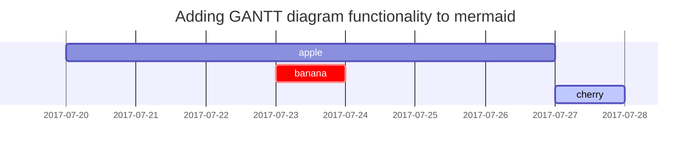

## Creando documentación con Jekyll

**Jekyll** es un generador de sitios estáticos escrito en Ruby. Se usa para crear blogs y páginas web que se pueden publicar fácilmente en servicios como GitHub Pages, convirtiendo archivos Markdown en sitios web rápidos y seguros.

A diferencia de los sistemas de gestión de contenidos como WordPress, Jekyll no necesita una base de datos: simplemente toma tus archivos .md (Markdown), .html y plantillas Liquid, y los compila en un conjunto de archivos HTML listos para desplegar.

### Porque Jekyll?

✅ Simplicidad y control total: Al trabajar con archivos planos, puedes versionar tu sitio como cualquier otro proyecto de software.

🚀 Velocidad y rendimiento: Al ser un sitio estático, se carga más rápido y es más seguro.

🤝 Integración con GitHub Pages: Puedes publicar tu sitio directamente desde un repositorio GitHub con solo hacer push a la rama correcta.

🛠️ Personalización completa: Usa Liquid, el motor de plantillas de Shopify, para lógica dentro del HTML.

📚 Ideal para blogs técnicos: Jekyll soporta posts, categorías, etiquetas y paginación de forma nativa.

<!-- markdownlint-capture -->
<!-- markdownlint-disable -->

### Instalación y Primeros Pasos
#### Instala Ruby y Bundler

```bash
gem install bundler jekyll
```
Crea un nuevo sitio

```
jekyll new mi-blog
cd mi-blog
bundle exec jekyll serve
```

Abre en el navegador http://localhost:4000 para ver tu sitio en acción.

### Publicar tu Sitio Jekyll con GitHub Pages
#### ¿Qué es GitHub Pages?
GitHub Pages es un servicio gratuito de GitHub que te permite alojar sitios web directamente desde un repositorio. Jekyll fue diseñado para integrarse con este servicio desde sus inicios, lo que facilita tener un blog o portafolio en línea sin preocuparte por servidores o infraestructura.

GitHub Pages puede compilar automáticamente tu sitio Jekyll si se cumplen estas condiciones:
- El proyecto no utiliza plugins personalizados.
- Se ajusta al entorno limitado de compilación que GitHub proporciona.
- Usa temas oficiales o configuraciones mínimas.

#### Formas de Publicar en GitHub Pages
Opción 1: Usar GitHub Pages con compilación automática
1. Crea un repositorio con el código de tu sitio Jekyll (excluyendo _site/).
2. En Settings > Pages, selecciona la rama que deseas publicar (usualmente main) y la carpeta raíz o /docs.
3. Asegúrate de tener un archivo index.md o index.html en esa carpeta.
4. GitHub compilará automáticamente tu sitio (si cumple los requisitos de seguridad) y estará disponible en:
https://<tu-usuario>.github.io/<repositorio>/

❗ Ten en cuenta que si usas plugins personalizados o configuración avanzada, GitHub Pages no podrá compilarlo directamente.

# H1 — heading
{: .mt-4 .mb-0 }

## H2 — heading
{: data-toc-skip='' .mt-4 .mb-0 }

### H3 — heading
{: data-toc-skip='' .mt-4 .mb-0 }

#### H4 — heading
{: data-toc-skip='' .mt-4 }
<!-- markdownlint-restore -->

## Paragraph

Quisque egestas convallis ipsum, ut sollicitudin risus tincidunt a. Maecenas interdum malesuada egestas. Duis consectetur porta risus, sit amet vulputate urna facilisis ac. Phasellus semper dui non purus ultrices sodales. Aliquam ante lorem, ornare a feugiat ac, finibus nec mauris. Vivamus ut tristique nisi. Sed vel leo vulputate, efficitur risus non, posuere mi. Nullam tincidunt bibendum rutrum. Proin commodo ornare sapien. Vivamus interdum diam sed sapien blandit, sit amet aliquam risus mattis. Nullam arcu turpis, mollis quis laoreet at, placerat id nibh. Suspendisse venenatis eros eros.

## Lists

### Ordered list

1. Firstly
2. Secondly
3. Thirdly

### Unordered list

- Chapter
  - Section
    - Paragraph

### ToDo list

- [ ] Job
  - [x] Step 1
  - [x] Step 2
  - [ ] Step 3

### Description list

Sun
: the star around which the earth orbits

Moon
: the natural satellite of the earth, visible by reflected light from the sun

## Block Quote

> This line shows the _block quote_.

## Prompts

<!-- markdownlint-capture -->
<!-- markdownlint-disable -->
> An example showing the `tip` type prompt.
{: .prompt-tip }

> An example showing the `info` type prompt.
{: .prompt-info }

> An example showing the `warning` type prompt.
{: .prompt-warning }

> An example showing the `danger` type prompt.
{: .prompt-danger }
<!-- markdownlint-restore -->

## Tables

| Company                      | Contact          | Country |
| :--------------------------- | :--------------- | ------: |
| Alfreds Futterkiste          | Maria Anders     | Germany |
| Island Trading               | Helen Bennett    |      UK |
| Magazzini Alimentari Riuniti | Giovanni Rovelli |   Italy |

## Links

<http://127.0.0.1:4000>

## Footnote

Click the hook will locate the footnote[^footnote], and here is another footnote[^fn-nth-2].

## Inline code

This is an example of `Inline Code`.

## Filepath

Here is the `/path/to/the/file.extend`{: .filepath}.

## Code blocks

### Common

```text
This is a common code snippet, without syntax highlight and line number.
```

### Specific Language

```bash
if [ $? -ne 0 ]; then
  echo "The command was not successful.";
  #do the needful / exit
fi;
```

### Specific filename

```sass
@import
  "colors/light-typography",
  "colors/dark-typography";
```
{: file='_sass/jekyll-theme-chirpy.scss'}

## Mathematics

The mathematics powered by [**MathJax**](https://www.mathjax.org/):

$$
\begin{equation}
  \sum_{n=1}^\infty 1/n^2 = \frac{\pi^2}{6}
  \label{eq:series}
\end{equation}
$$

We can reference the equation as \eqref{eq:series}.

When $a \ne 0$, there are two solutions to $ax^2 + bx + c = 0$ and they are

$$ x = {-b \pm \sqrt{b^2-4ac} \over 2a} $$

## Mermaid SVG



## Images

### Default (with caption)

{: width="972" height="589" }
_Full screen width and center alignment_

### Left aligned

{: width="972" height="589" .w-75 .normal}

### Float to left

{: width="972" height="589" .w-50 .left}
Praesent maximus aliquam sapien. Sed vel neque in dolor pulvinar auctor. Maecenas pharetra, sem sit amet interdum posuere, tellus lacus eleifend magna, ac lobortis felis ipsum id sapien. Proin ornare rutrum metus, ac convallis diam volutpat sit amet. Phasellus volutpat, elit sit amet tincidunt mollis, felis mi scelerisque mauris, ut facilisis leo magna accumsan sapien. In rutrum vehicula nisl eget tempor. Nullam maximus ullamcorper libero non maximus. Integer ultricies velit id convallis varius. Praesent eu nisl eu urna finibus ultrices id nec ex. Mauris ac mattis quam. Fusce aliquam est nec sapien bibendum, vitae malesuada ligula condimentum.

### Float to right

{: width="972" height="589" .w-50 .right}
Praesent maximus aliquam sapien. Sed vel neque in dolor pulvinar auctor. Maecenas pharetra, sem sit amet interdum posuere, tellus lacus eleifend magna, ac lobortis felis ipsum id sapien. Proin ornare rutrum metus, ac convallis diam volutpat sit amet. Phasellus volutpat, elit sit amet tincidunt mollis, felis mi scelerisque mauris, ut facilisis leo magna accumsan sapien. In rutrum vehicula nisl eget tempor. Nullam maximus ullamcorper libero non maximus. Integer ultricies velit id convallis varius. Praesent eu nisl eu urna finibus ultrices id nec ex. Mauris ac mattis quam. Fusce aliquam est nec sapien bibendum, vitae malesuada ligula condimentum.

### Dark/Light mode & Shadow

The image below will toggle dark/light mode based on theme preference, notice it has shadows.

{: .light .w-75 .shadow .rounded-10 w='1212' h='668' }
{: .dark .w-75 .shadow .rounded-10 w='1212' h='668' }

## Video


## Reverse Footnote

[^footnote]: The footnote source
[^fn-nth-2]: The 2nd footnote source
